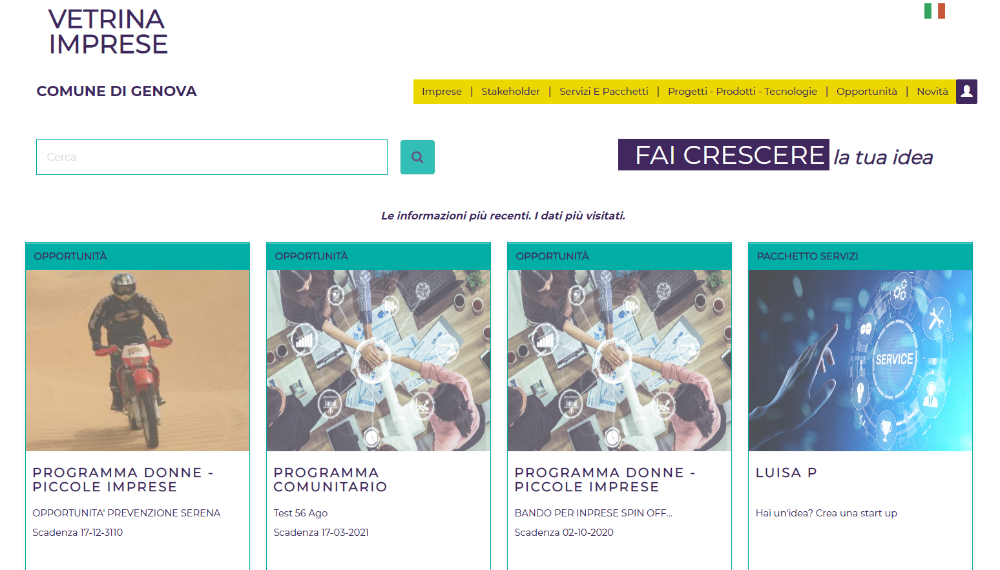
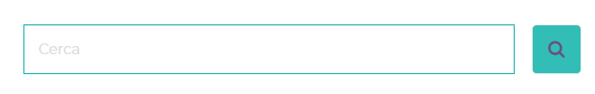
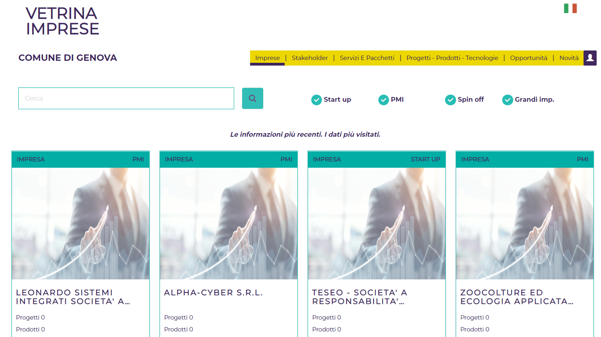
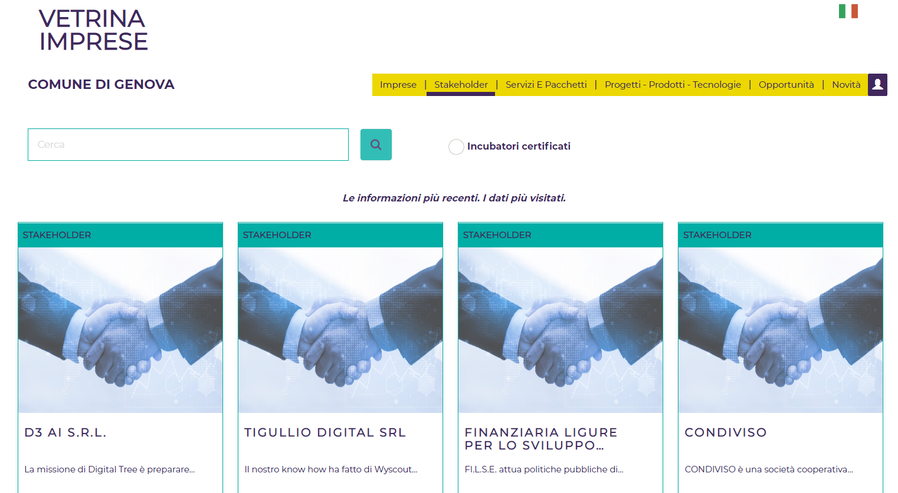
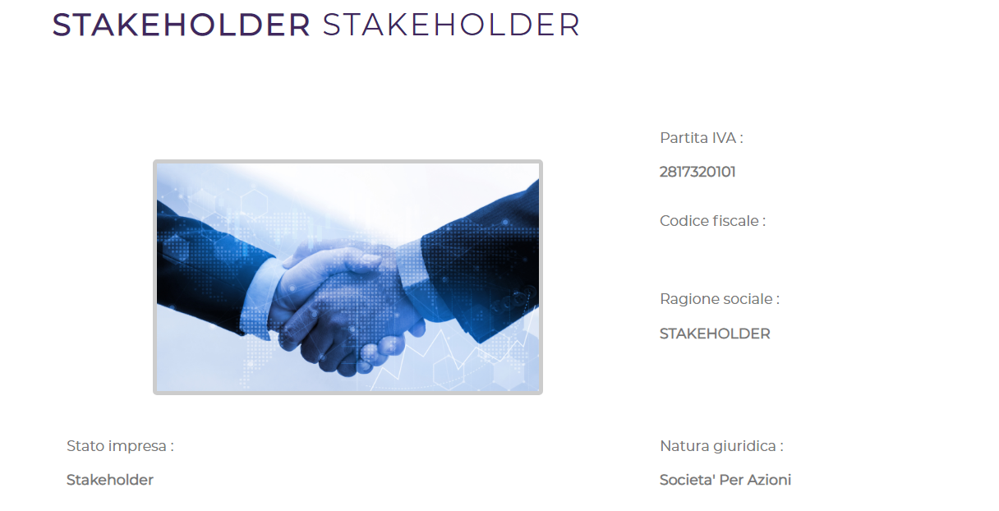
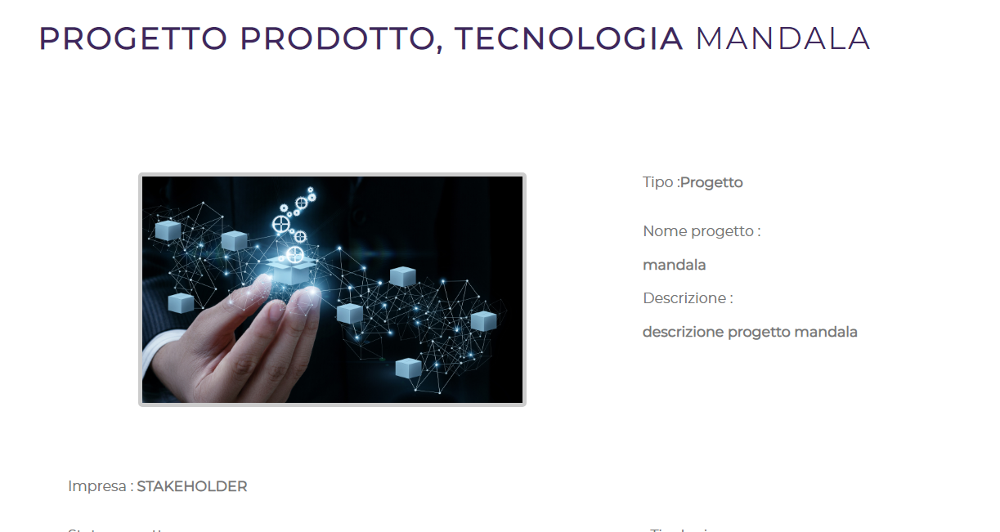
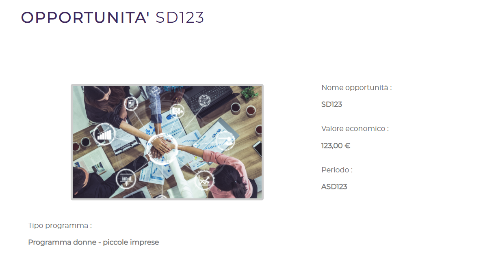
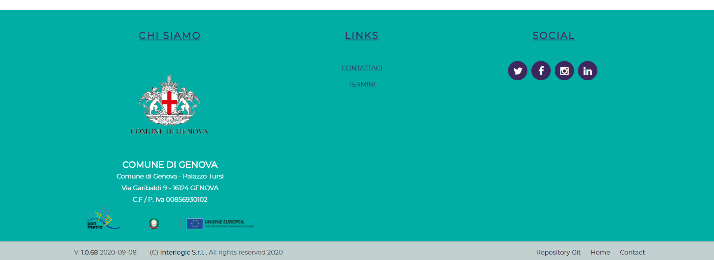

**Vetrina Impresa**

Manuale d’uso – Accesso Libero

**Sommario**

1 Introduzione 5

>   1.1 Avvertenze 5

2 Ricercare le informazioni e visualizzare i dati 6

>   2.1 Imprese 7

>   2.2 Stakeholder 9

>   2.3 Servizi e Pacchetti 10

>   2.4 Progetti prodotti tecnologie 12

>   2.5 Opportunità 13

>   2.6 Novità 15

3 Area Contatori 16

4 Area Informativa 16

>   4.1 Contattaci 17

>   4.2 Termini 17

>   4.3 Social 17

**Indice delle figure**

[Figura 1: Home page	6](#_Toc33435930)

[Figura 2: Barra di
ricerca	6](file:///Z:\GENOVA%20-%20Piattaforma%20Politiche%20Lavoro\Documentazione\03%20Evolutive%202019-2022%20-%20Vetrina%20Impresa\Manuali\GE-PPL-MUT-26-V02-Manuale%20utente%20-%20Accesso%20Libero.docx#_Toc33435931)

[Figura 3: Elenco imprese	8](#_Toc33435932)

[Figura 4: Dettaglio impresa	8](#_Toc33435933)

[Figura 5: Elenco Stakeholder	9](#_Toc33435934)

[Figura 6: Dettaglio Stakeholder	10](#_Toc33435935)

[Figura 7: Elenco Servizi e pacchetti	11](#_Toc33435936)

[Figura 8: Dettaglio Servizio	11](#_Toc33435937)

[Figura 9: Elenco Progetti / Prodotti	12](#_Toc33435938)

[Figura 10: Dettaglio Progetti / Prodotti	13](#_Toc33435939)

[Figura 11: Elenco Opportunità	14](#_Toc33435940)

[Figura 12: Dettaglio Opportunità	14](#_Toc33435941)

[Figura 13: Elenco News	15](#_Toc33435942)

[Figura 14: Dettaglio news	16](#_Toc33435943)

[Figura 15: Area Contatori	16](#_Toc33435944)

[Figura 16: Area Informativa	17](#_Toc33435945)

# Introduzione

Il Comune di Genova ha promosso la realizzazione della Piattaforma “Vetrina
Impresa”, finanziata nell’ambito del PON METRO.

La piattaforma permette di visualizzare le informazioni relative alle imprese /
stakeholder presenti sul territorio e ai progetti, tecnologie, prodotti svolti.
Inoltre visualizza i servizi ed gli insieme di servizi (in seguito denominati
“pacchetti”) che gli stakeholder possono erogare, le novità e le opportunità
presenti sul territorio. Le imprese che si accreditano alla piattaforma potranno
gestire tutti i loro dati con la possibilità di gestire eventuali news.

## Avvertenze

Ogni pagina della piattaforma è composta da:

-   **Testata**, ove è riportata la selezione della lingua (è possibile
    visualizzare in italiano o in inglese)

-   **Barra funzionale**, ove sono riportati:

    -   Il menu composto dalle voci: Home (Comune di Genova), Imprese,
        Stakeholder, Servizi e Pacchetti, Progetti - Prodotti - Tecnologie,
        Opportunità e Novità

    -   La funzionalità per accedere al portale con le credenziali SPID

-   **Area centrale**, ove sono riportati le informazioni con una barra per la
    ricerca dei dati

-   **Area contatori,** ove sono riportati dei contatori che riportano il numero
    delle informazioni memorizzare: il numero di prodotti e tecnologie, start up
    innovative, PMI (Piccole Medie Imprese) Innovative, Progetti, Spin Off e
    Grandi imprese.

-   **Area informativa**, ove si descrive il proprietario del sito, il link per
    il modulo di contatto e dei termini di utilizzo, e i collegamenti ai social
    network.

-   **Area finale**, ove viene visualizzato la versione, chi ha realizzato il
    sito e l’anno.

Si ricorda che per poter aggiornare i dati è necessario disporre delle
credenziali di accesso.

Per variare la lingua si seleziona il tasto “Bandierina” in alto a sinistra.

# Ricercare le informazioni e visualizzare i dati

Nella home page è possibile ricercare e visualizzare i dati presenti in archivio
relativi alle imprese e agli stakeholder in termini di dati generici, servizi
svolti dagli stakeholder e relativi pacchetti di servizi, progetti / prodotti
/tecnologie, novità. Inoltre è possibile visualizzare le opportunità presenti
sul territorio. La visualizzazione e la ricerca dei dati non richiede la
registrazione al sistema.

Vengono poi visualizzate le *snapshot* relative alle imprese, stakeholder,
progetti, prodotti, tecnologie, innovazioni, servizi, opportunità e news
maggiormente aggiornate / consultate sulla piattaforma, con la possibilità di
raggiungere direttamente il dettaglio dati delle stesse. Vengono presentati i
“*top eight*” generali, indipendentemente dalla loro categoria.

Figura 2: Home page

L'utente, per cercare delle informazioni genericamente sul sistema, inserisce
nel campo ricerca le parole chiavi che vuole trovare.

Il sistema effettua la ricerca tra le seguenti informazioni:

| **Entità**                       | **Campi**                                                                                                               |
|----------------------------------|-------------------------------------------------------------------------------------------------------------------------|
| Impresa                          | Codice fiscale, Partita Iva, Ragione sociale, Missione, Descrizione dell’impresa, Descrizione dell’attività, Ateco, Tag |
| Stakeholder                      |                                                                                                                         |
| Progetto / Prodotto / Tecnologia | Nome, Descrizione progetto, descrizione, requisiti, finalità, risultati, Stato, Tipo, Tag                               |
| Opportunità                      | Tipologia programma, Nome, Requisiti, Soggetti ammissibili, Settore, Tag                                                |
| News                             | Descrizione, Testo news, Tipo, Tag                                                                                      |
| Servizi                          | Descrizione tipo servizio, titolo, descrizione, denominazione servizi standard, Area di Competenza, Tag,                |
| Pacchetti                        | Descrizione, Titolo, Nome e cognome utente creazione e modifica, Macro area, Tag                                        |

Al termine della ricerca il sistema visualizzerà un elenco paginato con dei box
relativi alle varie entità trovate (con la loro immagine di riferimento, se è
stata inserita, oppure con una di default). La ricerca restituisce tutti i
risultati che contengono la chiave di ricerca al loro interno.

| **Entità**          | **Campi**                                             |
|---------------------|-------------------------------------------------------|
| Impresa             | Denominazione, numero di progetti, numero di prodotti |
| Stakeholder         | Denominazione e missione                              |
| Progetto / Prodotto | Nome progetto, Tipologia                              |
| Opportunità         | Tipologia programma (descrizione), Nome e la scadenza |
| News                | Descrizione                                           |
| Servizi             | Descrizione, Area di Competenza, Tipo di erogazione   |
| Pacchetto           | Nome Pacchetto, Macro area                            |

In testa saranno visualizzati i dati più aggiornati e quelli più visualizzati a
prescindere dalle categorie, seguiranno nei paragrafi seguenti le ricerche sullo
specifico ambito.

## Imprese

Selezionando la voce di menu “Imprese”, il sistema visualizza le imprese che
sono state maggiormente aggiornate / consultate sulla piattaforma, in modo
analogo alla ricerca generale, presente in Home Page. La differenza è solo
l'ambito nel quale viene effettuata la ricerca: in questo caso la sezione delle
imprese.

Figura 4: Elenco imprese

Da ogni box è possibile raggiungere il dettaglio delle informazioni relative
all'impresa.

Si tratta delle informazioni che gli utenti abilitati hanno introdotto
relativamente alla loro azienda, evidenziando missione, settore, obiettivi e
numeri che la contraddistinguono.

Figura 5: Dettaglio impresa

L'utente, per cercare delle informazioni relative alle imprese, inserisce nel
campo ricerca le parole chiavi che vuole trovare e può specificare la tipologia
di azienda: Start-up, PMI, Spin-off e Grandi imprese. Al termine della ricerca
il sistema visualizzerà un elenco paginato con dei box relativi alle varie
imprese trovate. La ricerca restituisce tutti i risultati che contengono le
chiavi di ricerca al loro interno.

## Stakeholder

Selezionando la voce di menu “Stakeholder”, il sistema visualizza gli
stakeholder che sono stati maggiormente aggiornati / consultati sulla
piattaforma, in modo analogo alla ricerca generale, presente in Home Page. La
differenza è solo l'ambito nel quale viene effettuata la ricerca: in questo caso
la sezione degli stakeholder.

Figura 6: Elenco Stakeholder

Da ogni box è possibile raggiungere il dettaglio delle informazioni relative
allo stakeholder.

Figura 7: Dettaglio Stakeholder

Si tratta delle informazioni che gli stakeholder hanno introdotto per
dettagliare le loro attività, evidenziando missione, settore, obiettivi e numeri
che la contraddistinguono.

L'utente, per cercare delle informazioni relative agli stakeholder, inserisce
nel campo ricerca le parole chiavi che vuole trovare e può specificare se
estrarre solo gli stakeholder che sono degli “Incubatori certificati”. Al
termine della ricerca il sistema visualizzerà un elenco paginato con dei box
relativi ai vari stakeholder trovati. La ricerca restituisce tutti i risultati
che contengono le chiavi di ricerca al loro interno.

## Servizi e Pacchetti

Selezionando la voce di menu “Servizi e Pacchetti”, il sistema visualizza i
servizi che sono stati maggiormente aggiornati / consultati sulla piattaforma,
in modo analogo alla ricerca generale, presente in Home Page. La differenza è
solo l'ambito nel quale viene effettuata la ricerca: in questo caso la sezione
dei servizi e pacchetti.

Figura 8: Elenco Servizi e pacchetti

Da ogni box è possibile raggiungere il dettaglio delle informazioni relative al
servizio o al pacchetto. Si tratta delle informazioni che gli utenti abilitati
hanno introdotto. I dati che descrivono i servizi sono: servizio Standard / Non
standard, Denominazione, descrizione, tipo, aree di competenza, stakeholder che
lo eroga, modalità di erogazione, Macro area, data inizio e data fine, tag.

Figura 9: Dettaglio Servizio

I dati che descrivono i pacchetti sono: Il nome, la macro area, la modalità di
erogazione, il luogo, i contatti, elenco dei servizi, le note, i tag.

L'utente, per cercare delle informazioni relative ai servizi o ai pacchetti,
inserisce nel campo ricerca le parole chiavi che vuole trovare e può specificare
se ricercare solo servizi o solo pacchetti o entrambi. Al termine della ricerca
il sistema visualizzerà un elenco paginato con dei box relativi ai vari servizi
/ pacchetti trovati. La ricerca restituisce tutti i risultati che contengono le
chiavi di ricerca al loro interno.

## Progetti prodotti tecnologie

Selezionando la voce di menu “Progetti Prodotti Tecnologie”, il sistema
visualizza i progetti / prodotti / tecnologie che sono stati maggiormente
aggiornati / consultati sulla piattaforma, in modo analogo alla ricerca
generale, presente in Home Page. La differenza è solo l'ambito nel quale viene
effettuata la ricerca: in questo caso la sezione dei progetti / prodotti.

Figura 10: Elenco Progetti / Prodotti

Da ogni box è possibile raggiungere il dettaglio delle informazioni relative ai
progetti prodotti.

Si tratta delle informazioni che le imprese / stakeholder abilitati hanno
introdotto relativamente ai loro progetti, prodotti, tecnologie in termini di
tipo, nome, descrizione, tipologia, stato, settore, obiettivi, allegati, durata,
data di scadenza, contatti, tag, etc.

Figura 11: Dettaglio Progetti / Prodotti

L'utente, per cercare delle informazioni relative ai progetti / prodotti,
inserisce nel campo ricerca le parole chiavi che vuole trovare e può specificare
la tipologia: Progetti, Prodotti, Tecnologie e Innovazioni. Al termine della
ricerca il sistema visualizzerà un elenco paginato con dei box relativi alle
varie dati trovate. La ricerca restituisce tutti i risultati che contengono le
chiavi di ricerca al loro interno.

## Opportunità

Selezionando la voce di menu “Opportunità”, il sistema visualizza le opportunità
che sono state maggiormente aggiornate / consultate sulla piattaforma, in modo
analogo alla ricerca generale, presente in Home Page. La differenza è solo
l'ambito nel quale viene effettuata la ricerca: in questo caso la sezione delle
opportunità.

Figura 12: Elenco Opportunità

Da ogni box è possibile raggiungere il dettaglio delle informazioni relative
all’opportunità.

Sono riportate le informazioni in merito alle opportunità presenti sul
territorio in termini di: nome, valore economico, requisiti, tipo di programma,
soggetti ammissibili, data di apertura, data di scadenza, tag, etc.

Figura 13: Dettaglio Opportunità

L'utente, per cercare delle informazioni relative alle opportunità, inserisce
nel campo ricerca le parole chiavi che vuole trovare. Al termine della ricerca
il sistema visualizzerà un elenco paginato con dei box relativi alle varie
opportunità trovate. La ricerca restituisce tutti i risultati che contengono le
chiavi di ricerca al loro interno.

## Novità

Selezionando la voce di menu “Novità”, il sistema visualizza le novità che sono
state maggiormente aggiornate / consultate sulla piattaforma, in modo analogo
alla ricerca generale, presente in Home Page. La differenza è solo l'ambito nel
quale viene effettuata la ricerca: in questo caso la sezione delle novità.

Figura 14: Elenco Novità

Da ogni box è possibile raggiungere il dettaglio delle informazioni relative
alla novità.

Figura 15: Dettaglio novità

L'utente, per cercare delle informazioni relative alle novità, inserisce nel
campo ricerca le parole chiavi che vuole trovare. Al termine della ricerca il
sistema visualizzerà un elenco paginato con dei box relativi alle varie novità
trovate. La ricerca restituisce tutti i risultati che contengono le chiavi di
ricerca al loro interno.

# Area Contatori

In questa sezione sono visualizzati il numero delle informazioni presenti sulla
Vetrina Impresa, suddivisa per tipologia.

Figura 16: Area Contatori

# Area Informativa

Nell’area informativa, in fondo alla pagina, sono riportate le informazioni per
utilizzo della piattaforma, chi ha commissionato la piattaforma, un modulo che
contattare il servizio, i link ai canali social.

Figura 17: Area Informativa

##  Contattaci

Nella area informativa, selezionando “Contattaci” è possibile visualizzare una
pagina dove sono riportate le seguenti colonne:

-   Indirizzo

-   N. telefonico del *call center*

-   Indirizzo email del supporto tecnico

È presente un'area con la mappa stradale e un'area “Contatti” che permette di
inviare direttamente un messaggio, dove è possibile inserire:

-   Cognome

-   Nome

-   Email

-   Oggetto del contatto

-   Testo

## Termini 

Nella area informativa, selezionando “Termini” è possibile visualizzare una
pagina dove sono i termini di utilizzo della piattaforma.

## Social

Nella area informativa, è presente una sezione Social dove sono riportati i link
a:

-   Twitter

-   Facebook

-   Instagram

-   Linkedin
