**Vetrina Impresa**

Manuale d’uso – Accesso accreditati

**Sommario**

1 Introduzione 4

>   1.1 Avvertenze 4

2 Ricercare le informazioni e visualizzare i dati 4

3 Accreditarsi al sistema 5

4 Visualizzare le proprie informazioni 6

5 Decodifiche 8

6 Delegati 9

>   6.1 Inserire delegato 9

7 Inserire e modificare i dati 10

>   7.1 Impresa 10

>   7.1.1 Modificare 10

>   7.2 Stakeholder 14

>   7.3 Servizi 15

>   7.3.1 Inserimento 15

>   7.3.2 Modifica e Cancellazione 17

>   7.4 Pacchetti 18

>   7.4.1 Inserimento 18

>   7.4.2 Modifica e Cancellazione 20

>   7.5 Progetti Prodotti Tecnologie 22

>   7.5.1 Inserimento 22

>   7.5.2 Modifica e Cancellazione 25

>   7.6 Novità 27

>   7.6.1 Inserimento 27

>   7.6.2 Modifica e Cancellazione 28

**Indice delle figure**

[Figura 1: Login alla piattaforma	5](#_Toc50471060)

[Figura 2: Voce di menu Accreditati	5](#_Toc50471061)

[Figura 3: Richiesta Accreditamento	6](#_Toc50471062)

[Figura 4: Menù presente sotto il login (dopo accreditamento)	6](#_Toc50471063)

[Figura 5: Visualizzare le mie info (impresa)	7](#_Toc50471064)

[Figura 6: Visualizzare le mie info (stakeholder)	7](#_Toc50471065)

[Figura 7: Visualizzare elenco codifiche	8](#_Toc50471066)

[Figura 8: Gestione tabelle di codifica	8](#_Toc50471067)

[Figura 9: Visualizza elenco delegati	9](#_Toc50471068)

[Figura 10: Inserire nuovo delegato	10](#_Toc50471069)

[Figura 11: Variazione lingua	10](#_Toc50471070)

[Figura 12: Modifica impresa	14](#_Toc50471071)

[Figura 13: Menu per inserire nuovo Servizio o un nuovo
Pacchetto	15](#_Toc50471072)

[Figura 14: Inserire nuovo servizio	17](#_Toc50471073)

[Figura 15: Modificare o Cancellare un servizio	18](#_Toc50471074)

[Figura 16: Inserire nuovo pacchetto	20](#_Toc50471075)

[Figura 17: Modificare o Cancellare un Pacchetto	22](#_Toc50471076)

[Figura 18: Menu per inserire nuovo Progetto / Prodotto /
Tecnologia	22](#_Toc50471077)

[Figura 19: Inserimento Progetto	24](#_Toc50471078)

[Figura 20: Inserimento Prodotto / Tecnologia	25](#_Toc50471079)

[Figura 21: Modificare o Cancellare un
Progetto/Prodotto/Tecnologia	26](#_Toc50471080)

[Figura 22: Menu per inserire nuova News	27](#_Toc50471081)

[Figura 23: Inserire una News	28](#_Toc50471082)

[Figura 24: Modificare o Cancellare una News	29](#_Toc50471083)

#  Introduzione

Il Comune di Genova ha promosso la realizzazione della Piattaforma “Vetrina
Impresa”, finanziata nell’ambito del PON METRO.

La piattaforma permette di visualizzare le informazioni relative alle imprese /
stakeholder presenti sul territorio e sui progetti, tecnologie, prodotti,
servizi e pacchetti. Inoltre permette di visualizzare le news e le opportunità
presenti sul territorio. Le imprese che si accreditano alla piattaforma potranno
gestire tutti i loro dati con la possibilità di gestire eventuali news.

## Avvertenze

Ogni pagina della piattaforma è composta da:

-   **Testata**, ove sono riportati i loghi

-   **Barra funzionale**, ove sono riportati:

    -   Il menu composto dalle voci: Home, Imprese, Stakeholder, Servizi e
        Pacchetti, Progetti Prodotti Tecnologie, Opportunità e News

    -   La funzionalità per accedere al portale con le credenziali SPID

-   **Area centrale**, ove sono riportati le informazioni con una barra per la
    ricerca dei dati

-   **Area contatori,** ove sono riportati dei contatori che riportano il numero
    delle informazioni memorizzare: il numero di prodotti e tecnologie, start up
    innovative, PMI (Piccole Medie Imprese) Innovative, Progetti, Spin Off e
    Grandi imprese.

-   **Area informativa**, ove si descrive il proprietario del sito, il link per
    il modulo di contatto e dei termini di utilizzo, e i collegamenti ai social
    network.

-   **Area finale**, ove viene visualizzato chi ha realizzato il sito e l’anno.

Si ricorda che per poter inserire / aggiornare i dati è necessario disporre
delle credenziali di accesso.

# Ricercare le informazioni e visualizzare i dati

Si veda il manuale utente per accesso libero alle informazioni.

# Accreditarsi al sistema

Per inserire / modificare i dati è necessario accedere alla piattaforma
attraverso il tasto “**Login**”. Per poter accedere è necessario avere le
credenziali SPID (Sistema Pubblico di Identità Digitale). Per richiedere utenza
SPID vedere i dettagli sul sito
[https://www.spid.gov.it/](https://www.spid.gov.it)).

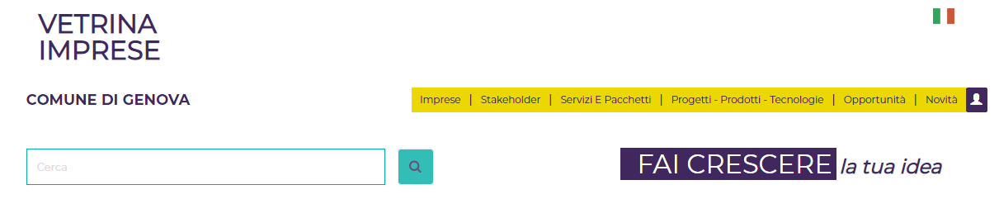

Figura 1: Login alla piattaforma

Dopo essere autenticati con SPID è necessario accreditarsi al sistema,
selezionando la voce di menu “Accreditati”, presente sotto il login.

Figura 2: Voce di menu Accreditati

Per inserire i dati il sistema visualizza una composizione guidata basata su due
passi:

1.  Presa visione dell’informativa sulla privacy

2.  Inserimento dei dati dell’impresa in termini di partita iva e/o codice
    fiscale, stato impresa ed email.

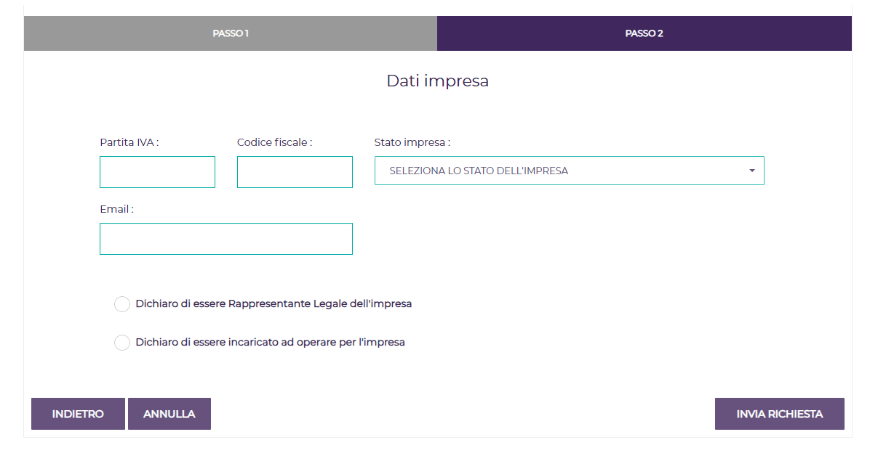

Figura 3: Richiesta Accreditamento

Specificati i dati, l’operatore che si vuole accreditare alla piattaforma deve
inviare la richiesta selezionando il pulsante “Invia Richiesta”. Se i dati
dell’impresa e dell’operatore che sta effettuando la richiesta sono presenti sui
sistemi regionali, la richiesta viene autorizzata automaticamente, altrimenti
verrà gestita manualmente dal gestore del sistema.

# Visualizzare le proprie informazioni

Gli utenti accreditati hanno la possibilità di visualizzare solo i loro dati,
selezionando la voce di menu “Le Mie Info”, presente sotto il login. I dati
vengono visualizzati come descritto nel manuale utente per accesso libero alle
informazioni, ma solo filtrate in base all’utente collegato.

Figura 4: Menù presente sotto il login (dopo accreditamento)

Per ricercare le proprie informazioni, utente ha la possibilità di specificare
la tipologia di dai: progetti, prodotti, tecnologie e news. Per gli utenti
stakeholder è possibile anche filtrare per servizi e pacchetti. Inoltre è
possibile specificare se visualizzare anche i contenuti scaduti cioè quelli che
hanno la data fine antecedente alla data odierna

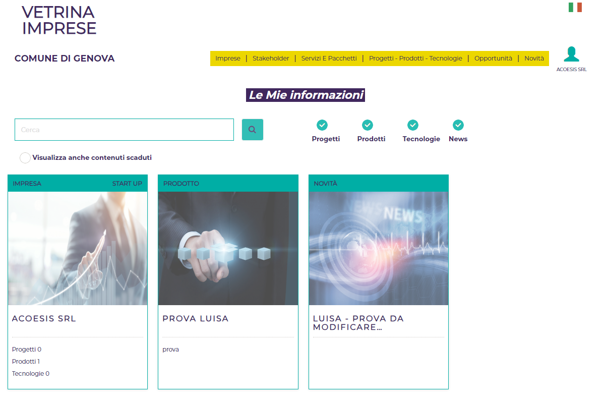

Figura 5: Visualizzare le mie info (impresa)

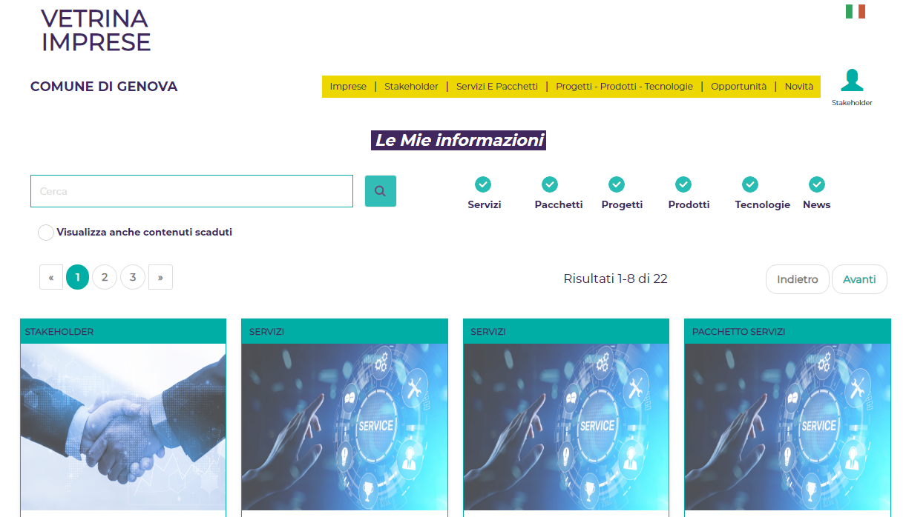

Figura 6: Visualizzare le mie info (stakeholder)

# Decodifiche

Le imprese accreditate hanno la possibilità di gestire la tabella di decodifica
dei “tag”, mentre gli stakeholder hanno la possibilità di gestire anche la
tabella di “denominazione servizi” per la gestione dei servizi standard. La
funzionalità è attivabile dal menu del login (vedi Figura 4: Menù presente sotto
il login (dopo accreditamento)).

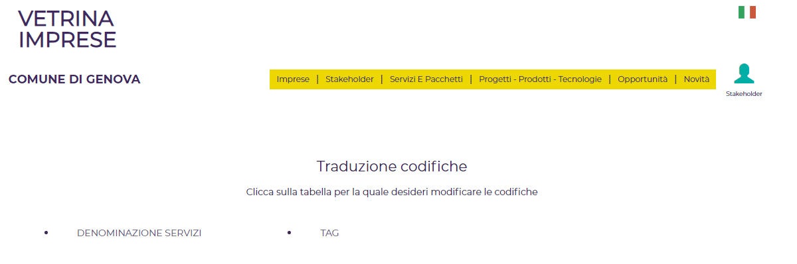

Figura 7: Visualizzare elenco codifiche

Seleziona la tabella di codifica, ad esempio tag è possibile:

-   inserirne una nuova, si inserisce la descrizione e si attiva la funzionalità
    “Salva”

-   modificarla, si seleziona la codifica da modificare, si modifica e si attiva
    la funzionalità “Salva”

-   cancellarla, si seleziona la codifica da cancellare e si seleziona il tasto
    “Elimina codifica”

Figura 8: Gestione tabelle di codifica

# Delegati

Le imprese accreditate hanno la possibilità di definire altre persone (delegati)
che possono accedere alla Vetrina Impresa tramite SPID ed operare sui dati
dell’azienda o dello stakeholder. La funzionalità “Delegati” è attivabile dal
menu del login (vedi Figura 4: Menù presente sotto il login (dopo
accreditamento)).

Il sistema visualizza elenco dei delegati, in termini nome e cognome, codice
fiscale. Solo amministratore delegato (indicato con \*) ha la possibilità di
aggiungere un delegato selezionando il pulsante “Aggiungi nuovo delegato”; ha
anche la possibilità di rimuove un delegato selezionando il pulsante

.

Figura 9: Visualizza elenco delegati

## Inserire delegato

Selezionata la funzionalità “Aggiungi nuovo delegato”, il sistema visualizza una
finestra dove è possibile inserire i dati (nome, cognome, codice fiscale e
email) o ricercarlo in banca dati se è un soggetto già accreditato per un’altra
azienda. Specificati o ricercati i dati, si seleziona la funzionalità “Salva
nuovo delegato”.

Figura 10: Inserire nuovo delegato

# Inserire e modificare i dati

I dati possono essere inseriti sia in lingua italiana che inglese, attraverso la
selezione della “Bandierina” presente in alto a sinistra.

Figura 11: Variazione lingua

## Impresa

### Modificare

Gli utenti accreditati hanno la possibilità, dopo essersi autenticati alla
piattaforma di modifica re i dati della propria impresa. È necessario ricercare
la propria impresa e visualizzare il dettaglio. Il sistema visualizza la
maschera di dettaglio della propria impresa in modifica. L’operatore inserisce i
dati, specifica quali sono i mercati di riferimento, gli elementi di
innovazione, gli stakeholder di riferimento, i servizi erogati, i progetti
svolti, i servizi erogati, … ed al termine seleziona il tasto “Applica
Modifiche”.

Si precisa che per le imprese / stakeholder ubicate nel comune di “Genova” si
inserisce solo il campo “Indirizzo”, anche in modo parziale, in quanto il
sistema ricerca il valore specificato tra i dati della toponomastica. Il sistema
valorizza la lista valori “indirizzo” con i dati estratti. Selezionato
l’indirizzo il sistema compila la lista valori “numero civico”. Selezionato il
numero civico, il sistema imposta il CAP ed i campi latitudine e longitudine ed
aggiorna la mappa sottostante.

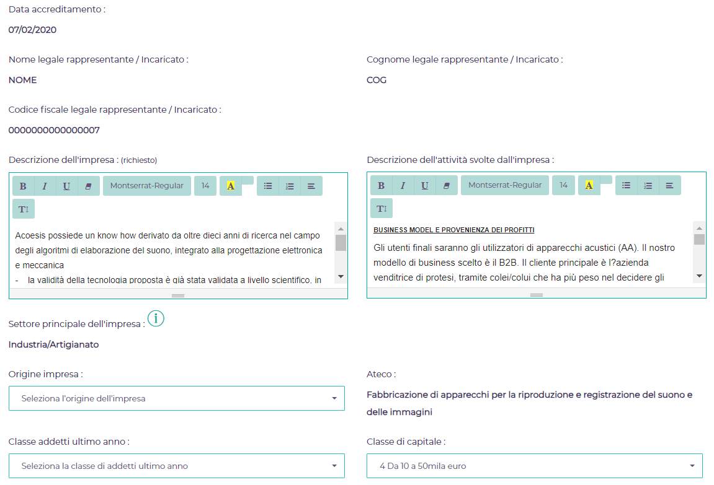

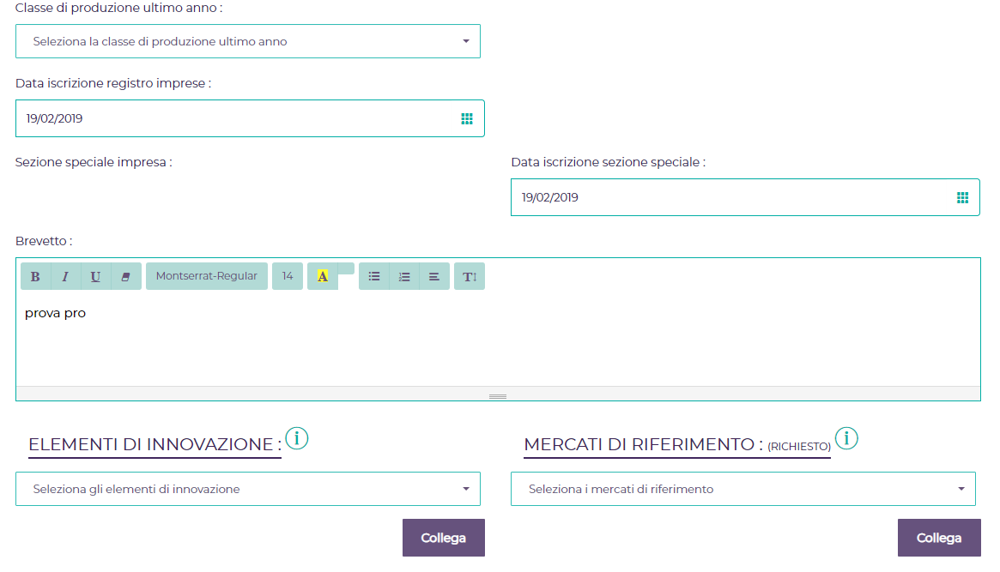

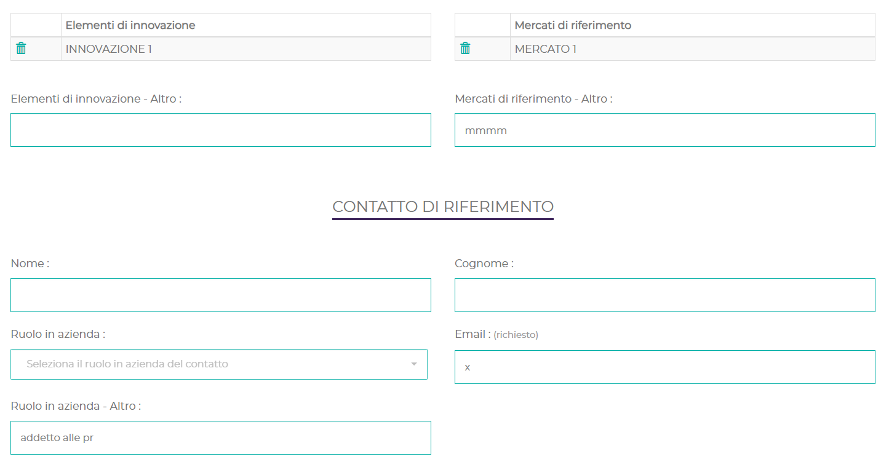

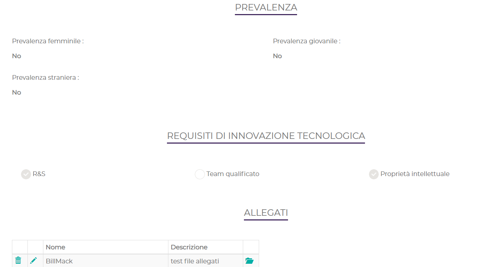

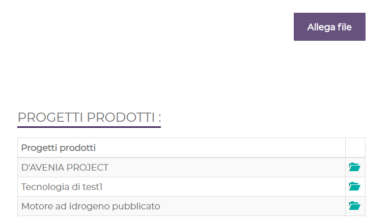

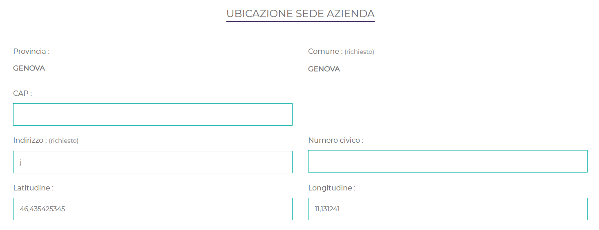

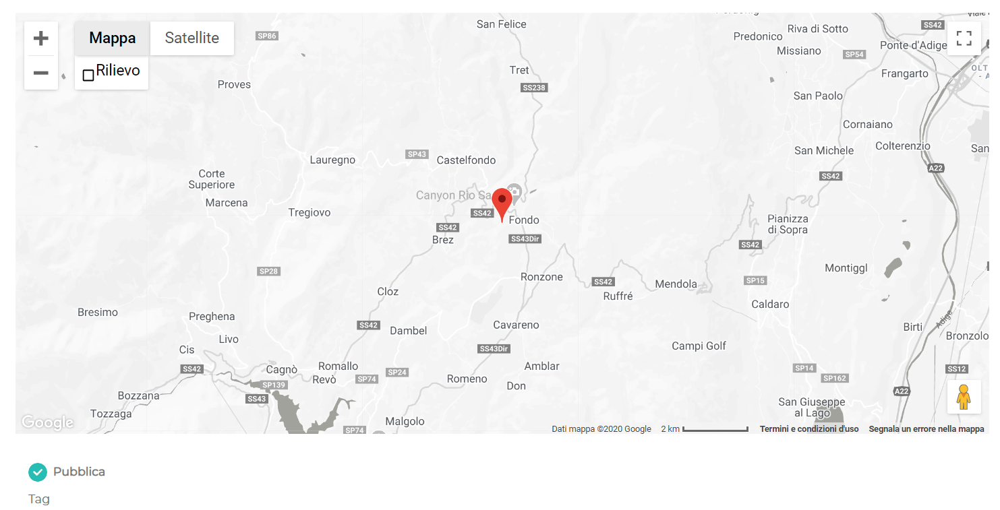

Figura 12: Modifica impresa

## Stakeholder

Gli utenti accreditati stakeholder hanno la possibilità, dopo essersi
autenticati alla piattaforma di modificare i propri dati e delle imprese di cui
sono stakeholder di riferimento, se non sono ancora accreditate. Le modalità
sono analoghe a quelle previste per le imprese.

## Servizi

### Inserimento

Gli utenti stakeholder, dopo che si sono autenticati e si sono accreditati,
hanno la possibilità di inserire dei nuovi servizi, selezionando la voce di menu
“Servizi” ed il tasto “Nuovo” o inserire nuovi pacchetti.

Figura 13: Menu per inserire nuovo Servizio o un nuovo Pacchetto

Il sistema visualizza una composizione guidata basata su quattro passi:

1.  Dati di base (nel caso si selezioni servizio standard, il sistema visualizza
    il campo “denominazione servizio” associato ad un menù a tendina, dove si
    seleziona una denominazione *standard*, cioè predefinita dal sistema)

2.  Il luogo di erogazione e riferimenti

3.  Caratteristiche del servizio

4.  Termini e condizioni

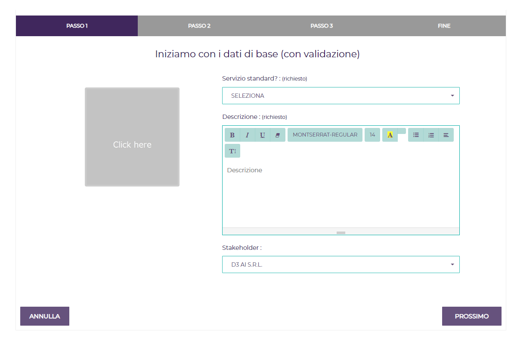

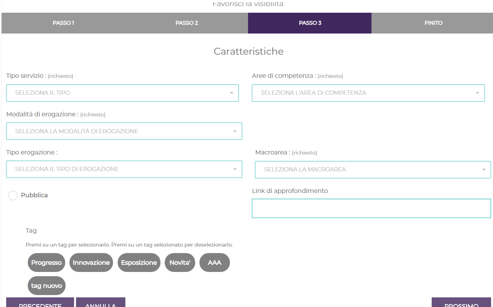

Figura 14: Inserire nuovo servizio

### Modifica e Cancellazione

Gli utenti stakeholder, dopo che si sono autenticati e si sono accreditati
possono modificare e cancellare i propri servizi. Il sistema visualizza in quali
pacchetti è presente il servizio selezionato.

Il sistema visualizza i dati in modifica, l’utente può aggiornare i dati e
selezionare il tasto “Applica Modifiche” oppure per cancellare selezionare il
tasto “Elimina servizio”.

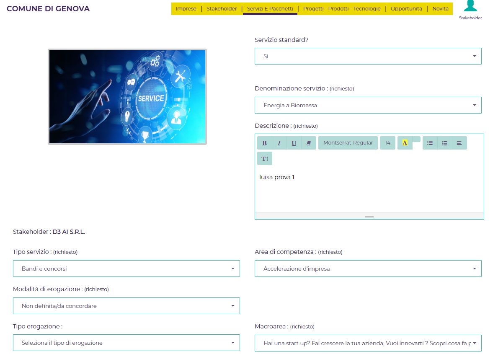

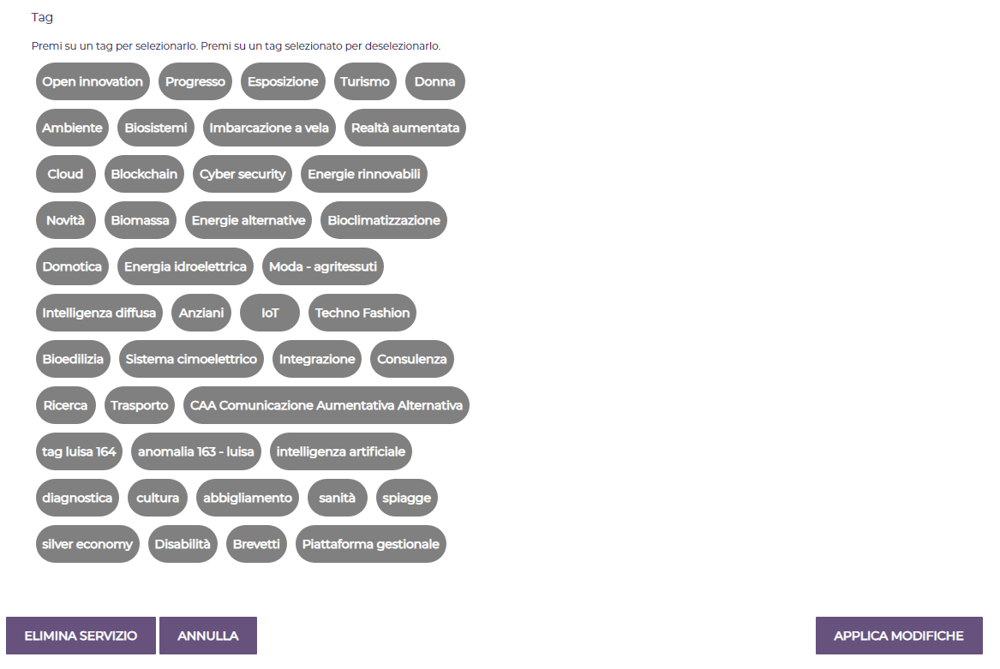

Figura 15: Modificare o Cancellare un servizio

## Pacchetti

### Inserimento

Gli utenti stakeholder, dopo che si sono autenticati e si sono accreditati,
hanno la possibilità di inserire dei nuovi pacchetti. (Vedi figura Menu per
inserire nuovo Servizio o un nuovo Pacchetto).

Il sistema visualizza una composizione guidata basata su quattro passi:

1.  Dati di base

2.  Il luogo di erogazione e riferimenti

3.  Caratteristiche del pacchetto dove è possibile selezionare i propri servizi
    (“Servizi collegati all’utente”) ed i servizi di altri stakeholder (“Servizi
    Generali”)

4.  Termini e condizioni (analogo a servizi)

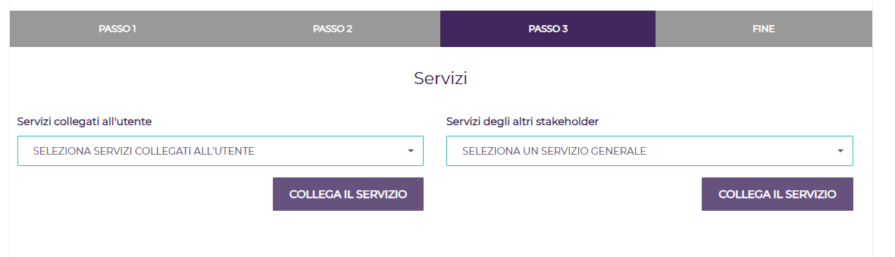

Figura 16: Inserire nuovo pacchetto

### Modifica e Cancellazione

Gli stakeholder, dopo che si sono autenticati e si sono accreditati possono
modificare e cancellare i pacchetti.

Il sistema visualizza i dati in modifica, l’utente può aggiornare i dati e
selezionare il tasto “Applica Modifiche” oppure per cancellare selezionare il
tasto “Elimina Pacchetto”.

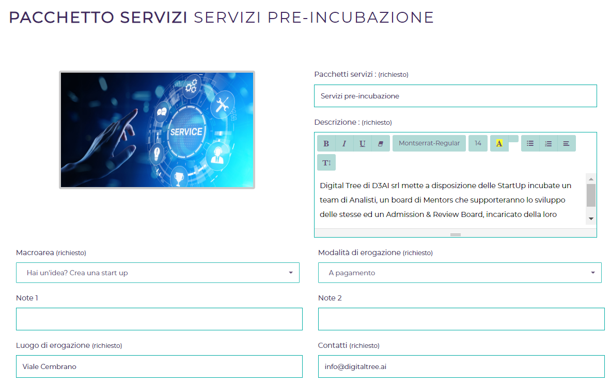

Figura 17: Modificare o Cancellare un Pacchetto

## Progetti Prodotti Tecnologie

### Inserimento

Gli utenti, dopo che si sono autenticati e si sono accreditati, hanno la
possibilità di inserire dei nuovi progetti, prodotti e tecnologie, selezionando
la voce di menu “Progetti - Prodotti -Tecnologie” ed il tasto “Nuovo”.

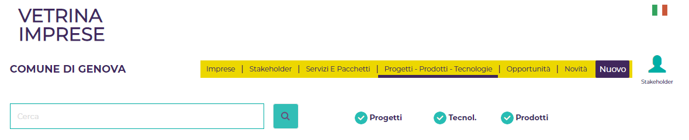

Figura 18: Menu per inserire nuovo Progetto / Prodotto / Tecnologia

Il sistema visualizza una composizione guidata basata su quattro passi:

1.  Dati di base

2.  Caratteristiche (varia a seconda della tipologia progetto, prodotto o
    tecnologia)

3.  Valori occupazionali, economici e contatti (varia a seconda della tipologia
    progetto, prodotto o tecnologia)

4.  Termini e condizioni (analogo a servizi)

Figura 19: Inserimento Progetto

Il Passo 2 per i Prodotti e le Tecnologie è analogo ai Progetti, ma non vengono
richiesti gli obiettivi. Il Passo 3 per i Prodotti e le Tecnologie richiede i
seguenti dati:

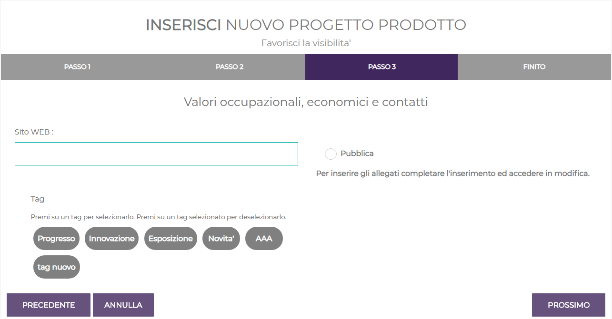

Figura 20: Inserimento Prodotto / Tecnologia

### Modifica e Cancellazione

Gli utenti, dopo che si sono autenticati e si sono accreditati possono
modificare e cancellare i propri progetti /prodotti /tecnologie.

Il sistema visualizza i dati in modifica, l’utente può aggiornare i dati e
selezionare il tasto “Applica Modifiche” oppure per cancellare selezionare il
tasto “Cancella”. L’operatore può aggiungere gli allegati.

Figura 21: Modificare o Cancellare un Progetto/Prodotto/Tecnologia

## Novità

### Inserimento

Gli utenti, dopo che si sono autenticati e si sono accreditati, hanno la
possibilità di inserire delle news, selezionando la voce di menu “Novità” ed il
tasto “Nuovo”.

Figura 22: Menu per inserire nuova News

Il sistema visualizza una composizione guidata basata su quattro passi:

1.  Dati di base

2.  Pertinenza della news, cioè si specifica se è una news relativa all’impresa,
    ai servizi o ai progetti / prodotti.

3.  Contenuto della news

4.  Termini e condizioni (analogo a quello per i servizi)

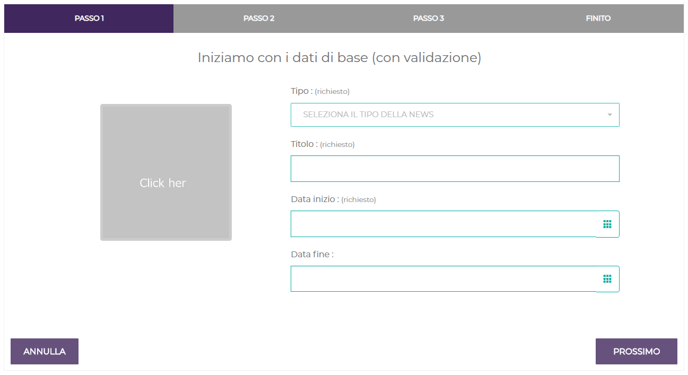

Figura 23: Inserire una News

L’utente stakeholder ha anche la possibilità di specificare una novità
relativamente ad un servizio.

### Modifica e Cancellazione

Gli utenti, dopo che si sono autenticati e si sono accreditati possono
modificare e cancellare le proprie news, per gli stakeholder, quelli delle
imprese di riferimento.

Il sistema visualizza i dati in modifica, l’utente può aggiornare i dati e
selezionare il tasto “Applica Modifiche” oppure per cancellare selezionare il
tasto “Cancella news”.

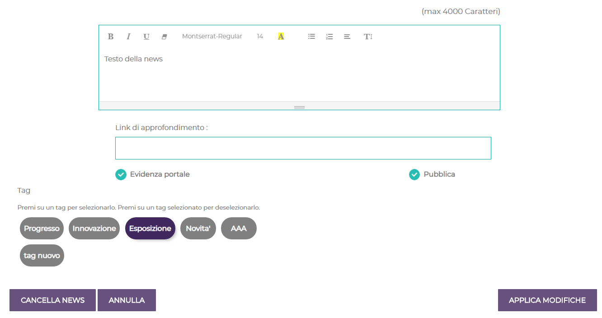

Figura 24: Modificare o Cancellare una News
