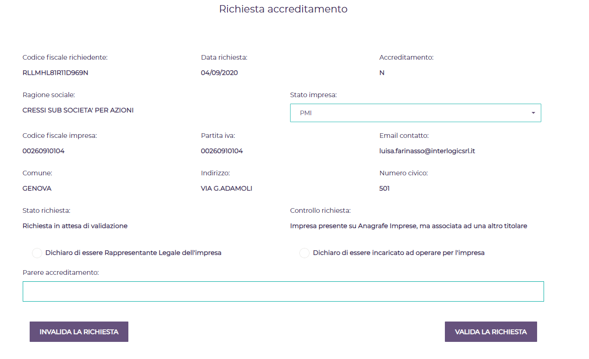
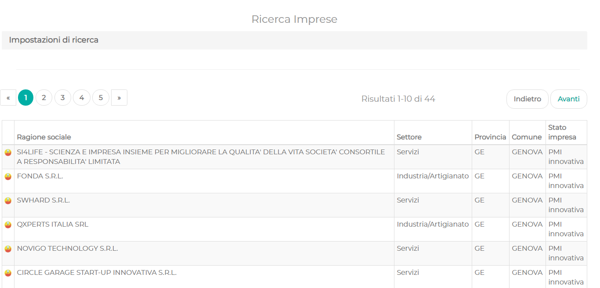
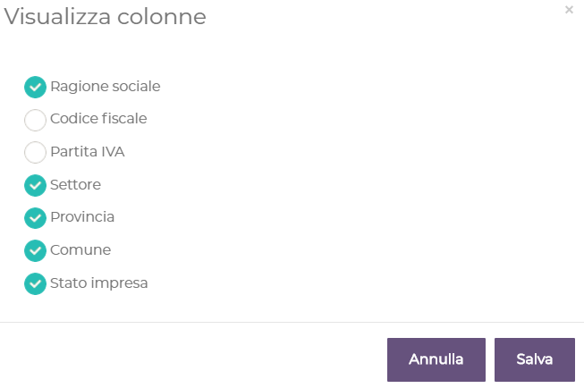
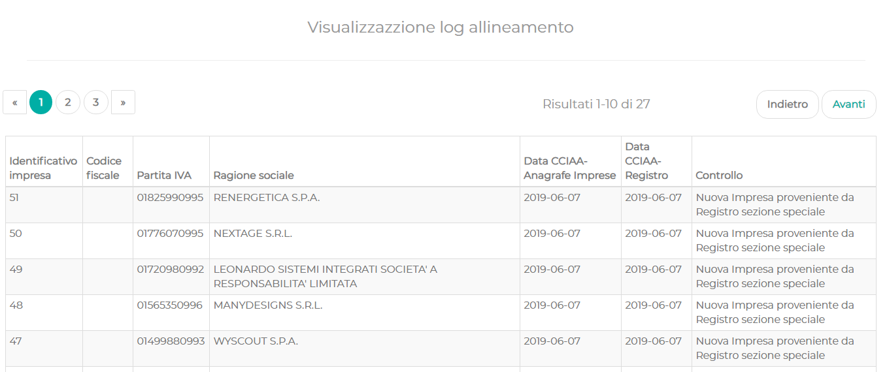
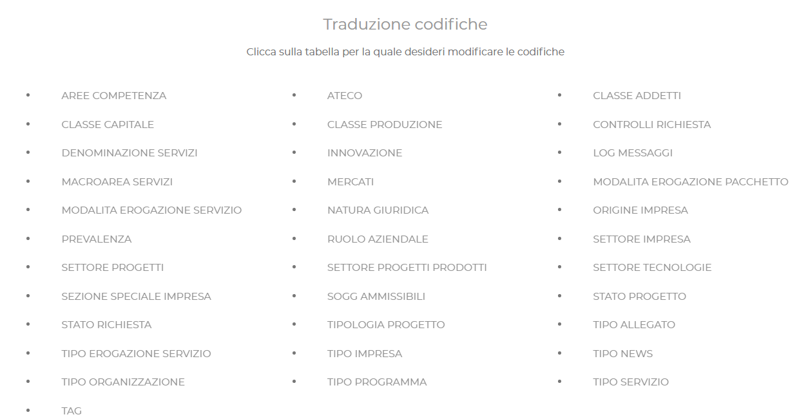
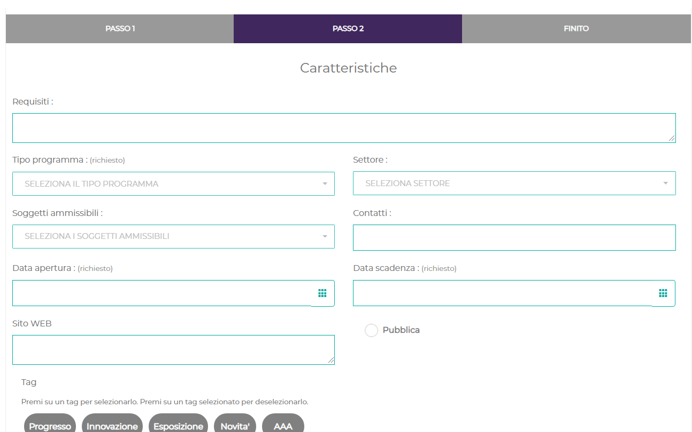
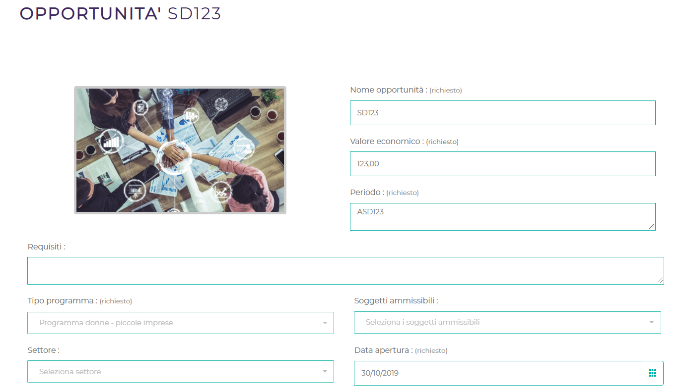

**Vetrina Impresa**

Manuale d’uso – Amministratore

**Sommario**

1 Introduzione 4

>   1.1 Avvertenze 4

2 Accreditamento 4

3 Ricerca estesa delle imprese 6

4 Visualizzare log di allineamento 7

5 Gestione codifiche 8

6 Imprese 9

7 Inserire e modificare le opportunità 9

>   7.1 Inserimento 9

>   7.2 Modifica e Cancellazione 10

8 Procedura di allineamento 11

**Indice Figure**

[Figura 1: Menu amministratore	5](#_Toc50472161)

[Figura 2: Richieste Accreditamento	5](#_Toc50472162)

[Figura 3: Validare / Invalidare Accreditamento	6](#_Toc50472163)

[Figura 4: Ricerca Estesa Imprese - Elenco imprese	7](#_Toc50472164)

[Figura 5: Ricerca Estesa Imprese - Impostazioni di ricerca	7](#_Toc50472165)

[Figura 6: Ricerca Estesa Imprese -
Colonne	7](../../GE-PPL-MUT-28-V03-Manuale%20utente%20-%20Amministratore.docx#_Toc50472166)

[Figura 7: Log di Allineamento	8](#_Toc50472167)

[Figura 8: Visualizza elenco tabelle codifiche	8](#_Toc50472168)

[Figura 9: Gestione decodifiche	9](#_Toc50472169)

[Figura 10: Menu per inserire nuova Opportunità	9](#_Toc50472170)

[Figura 11: Inserire una Opportunità	10](#_Toc50472171)

[Figura 12: Modificare / Cancellare opportunità	11](#_Toc50472172)

#  Introduzione

Il Comune di Genova ha promosso la realizzazione della Piattaforma “Vetrina
Impresa”, finanziata nell’ambito del PON METRO.

La piattaforma permette di visualizzare le informazioni relative alle imprese /
stakeholder presenti sul territorio e sui progetti, tecnologie, prodotti,
servizi svolti dalle imprese. Inoltre permette di visualizzare le novità e le
opportunità presenti sul territorio. Le imprese che si accreditano alla
piattaforma potranno gestire tutti i loro dati con la possibilità di gestire
eventuali novità.

L’utente amministratore ha inoltre la possibilità di gestire le richieste di
accreditamento (quelle che il sistema non è riuscita ad accreditare
automaticamente), di visualizzare esito delle elaborazioni notturne di
aggiornamento dati, di ricercare in modo esteso le imprese presenti e inserire /
modificare le opportunità presenti sul territorio.

## Avvertenze

Ogni pagina della piattaforma è composta da:

-   **Testata**, ove sono riportati i loghi

-   **Barra funzionale**, ove sono riportati:

    -   Il menu composto dalle voci: Home (Logo del comune di Genova), Imprese,
        Stakeholder, Servizi, Progetti Prodotti, Opportunità e News

    -   La funzionalità per accedere al portale con le credenziali SPID

-   **Area centrale**, ove sono riportati le informazioni con una barra per la
    ricerca dei dati

-   **Area contatori,** ove sono riportati dei contatori che riportano il numero
    delle informazioni memorizzare: il numero di prodotti e tecnologie, start up
    innovative, PMI (Piccole Medie Imprese) Innovative, Progetti, Spin Off e
    Grandi imprese.

-   **Area informativa**, ove si descrive il proprietario del sito, il link per
    il modulo di contatto e dei termini di utilizzo, e i collegamenti ai social
    network.

-   **Area finale**, ove viene visualizzato chi ha realizzato il sito e l’anno.

Si ricorda che per poter inserire / aggiornare i dati è necessario disporre
delle credenziali di accesso.

# Accreditamento

Dopo essersi autenticato, l’amministratore del sistema selezionando il login ha
la possibilità di accedere alle richieste di accreditamento delle imprese
selezionando la voce “Accreditamento”.

Figura 1: Menu amministratore

Il sistema visualizza la maschera con elenco delle richieste di accreditamento.
L’amministratore ha la possibilità di impostare una serie di parametri di
ricerca.

Figura 2: Richieste Accreditamento

Individuata una richiesta da trattare, l’amministratore ha la possibilità di
validare le richieste o di rifiutarle selezionando rispettivamente la
funzionalità “Valida la richiesta” o “Invalida la richiesta”. Inoltre
amministratore ha la possibilità di modificare lo stato dell’impresa.

Figura 3: Validare / Invalidare Accreditamento

# Ricerca estesa delle imprese

Dopo essersi autenticato, l’amministratore del sistema selezionando il login ha
la possibilità di accedere alla ricerca estesa delle imprese selezionando la
voce “Ricerca Estesa”.

Il sistema visualizza un elenco paginato delle imprese in termini di ragione
sociale, settore, provincia, comune e stato impresa. L’amministratore ha la
possibilità di ordinare i dati selezionando le colonne.

Figura 4: Ricerca Estesa Imprese - Elenco imprese

L’amministratore può impostare i filtri di ricerca selezionando “Impostazioni di
ricerca”.

Figura 5: Ricerca Estesa Imprese - Impostazioni di ricerca

Ha disposizione la funzione “Azzera filtri” per cancellare i dati impostati”, la
funzione “Colonne” per poter specificare quali dati estrarre e la possibilità di
specificare quanti risultati per pagina (10, 20, 50 o 100)

# Visualizzare log di allineamento

Dopo essersi autenticato, l’amministratore del sistema selezionando il login ha
la possibilità di accedere alla ricerca estesa delle imprese selezionando la
voce “Log Allineamento”. Il sistema visualizza un elenco paginato del log di
allineamento.

Figura 7: Log di Allineamento

# Gestione codifiche

Dopo essersi autenticato, l’amministratore del sistema selezionando il login ha
la possibilità di accedere alla gestione delle codifiche selezionando la voce
“Traduzione codifiche”.

Figura 8: Visualizza elenco tabelle codifiche

Selezionata una tabella, amministratore ha la possibilità di:

-   inserirne una nuova, si inserisce la descrizione e si attiva la funzionalità
    “Salva”

-   modificarla, si seleziona la codifica da modificare, si modifica e si attiva
    la funzionalità “Salva”

-   cancellarla, si seleziona la codifica da cancellare e si seleziona il tasto
    “Elimina codifica”

Figura 9: Gestione decodifiche

# Imprese

L’amministratore può modificare i dati delle imprese, si veda il manuale degli
operatori accreditati, se impresa non è accreditata, cioè non è presente la data
accreditamento..

# Inserire e modificare le opportunità

## Inserimento

L’amministratore, dopo che si è autenticato, ha la possibilità di inserire delle
opportunità, selezionando la voce di menu “Opportunità” ed il tasto “Nuovo”.

Figura 10: Menu per inserire nuova Opportunità

Il sistema visualizza una composizione guidata basata su quattro passi:

1.  Dati di base

2.  Caratteristiche

3.  Termini e condizioni (analogo a servizi)

Figura 11: Inserire una Opportunità

## Modifica e Cancellazione

L’utente amministratore, dopo che si è autenticato, può modificare e cancellare
le opportunità.

Il sistema visualizza i dati in modifica, l’utente può aggiornare i dati e
selezionare il tasto “Applica Modifiche” oppure per cancellare selezionare il
tasto “Cancella opportunità”.

Figura 12: Modificare / Cancellare opportunità

# Procedura di allineamento 

Per lanciare la procedura di allineamento:

-   Accedere alla cartella ove è presente il batch /opt/batch

-   Editare il file “run_batch.sh” per i sistemi Unix, “run_batch.bat” per i
    sistemi Windows, impostando i parametri di input:

    1.  Il percorso completo del file Excel (.xls) contenente le PMI innovative.

    2.  Il percorso completo del file Excel (.xls) contenente le start-up.

-   Salvare il file.

-   Lanciare la Shell run_barch.sh (ex. sudo ./run_batch.sh)

Il processo scrive un file di log “batchVimp.log” in /opt/batch/.
